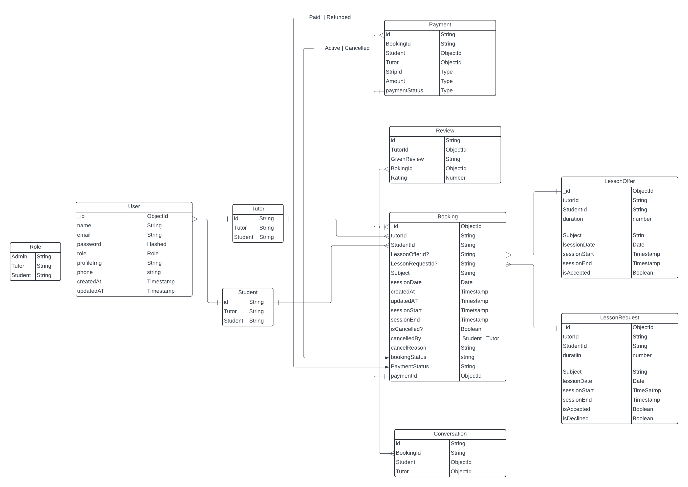
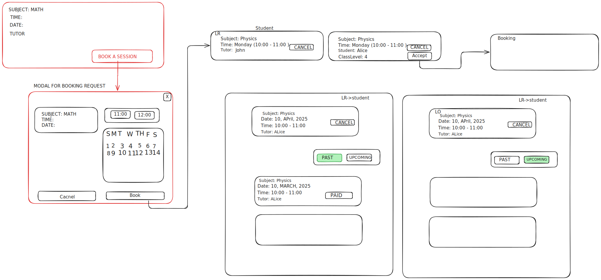

# LinkTutor

[](https://github.com/yourusername/linktutor)
[](LICENSE)

LinkTutor is a comprehensive platform where students can discover tutors, book sessions, and manage their learning journey. Tutors can create profiles, list subjects, and manage their availability. An admin panel will oversees user registrations, tutor approvals, and overall platform content.

---

## Overview

LinkTutor aims to simplify the process of connecting students with expert tutors. With an intuitive interface and powerful backend management, the platform ensures a smooth and engaging experience for all users.

---

## Features ( Development Ongoing... )

- **Student**:
  - Browse tutors
  - Create lesson requests
  - View upcoming/past bookings
- **Tutor**:
  - Manage availability
  - Accept/decline lesson requests
  - View and manage bookings
- **Admin**:
  - Oversee user registrations
  - Approve tutors
  - Monitor platform content

---

## UI Documentation

### System Diagram

Below a diagram that provides an overview of the platform's architecture:



### Lesson Request and Booking Flow

This diagram visualizes the journey of a lesson request — from initiation to completion — including the different states and actions available to both students and tutors. It reflects how users interact with the platform and how the backend supports this flow.

📌 **Highlights:**

- Students can initiate booking requests by selecting a subject, date, and time.
- Tutors receive requests and can either accept or decline them.
- Upon acceptance, a Booking is created.
- Both students and tutors can view and manage upcoming, past, or paid sessions.
- UI accommodates cancellation logic and session status tagging (e.g., PAID, UPCOMING, PAST).




### Payment Integration Flow for LinkTutor (Planned...)

## Flow Summary
- Student sends a Lesson Request.
- Tutor receives it and can Accept or Decline.
- If Declined → ❌ No booking created, no payment processed.
- If Accepted → ✅ Booking created → Payment processed.

### Screenshots

- **Home Page:**
  
- **Tutor Profile:**
  

---

## API Documentation

# Auth

POST /auth/register
Content-Type: application/json

Request Body (example):

```json
{
  "name": "John Doe",
  "email": "john@example.com",
  "password": "secret123",
  "role": "student"
}
```

POST /auth/login
Content-Type: application/json

Request Body (example):

```json
{
  "email": "john@example.com",
  "password": "secret123"
}
```

# User Management

POST /users/tutor
Content-Type: application/json

Request Body (example):

```json
{
  "name": "Jane Tutor",
  "email": "jane.tutor@example.com",
  "password": "somepass",
  "subjects": ["Math", "Physics"],
  "availability": [
    {
      "day": "Monday",
      "startTime": "09:00",
      "endTime": "11:00"
    }
  ]
}
```

POST /users/student
Content-Type: application/json

Request Body (example):

```json
{
  "name": "John Student",
  "email": "john.student@example.com",
  "password": "somepass"
}
```

# Lesson Requests

POST /lesson-requests
Content-Type: application/json

Request Body (example):

```json
{
  "tutorId": "67cb2e558307779921dea362",
  "studentId": "67cb2e5e8307779921dea369",
  "subject": "Mathematics",
  "duration": 2,
  "sessionDate": "2025-03-08T00:00:00.000Z",
  "sessionStart": "2025-03-08T09:00:00.000Z",
  "sessionEnd": "2025-03-08T11:00:00.000Z"
}
```

# Accept a Lesson Request & Create Booking

POST /lesson-requests/:id/accept-request

Description:

- Marks `isAccepted = true` on the request
- Creates a corresponding Booking in the Booking collection

Example Response: (will be changed)

```json
{
  "success": true,
  "message": "Lesson request accepted successfully, booking created!",
  "data": {
    "request": {
      "_id": "67cc4244152f8601b3cf1d60",
      "tutorId": "67cb2e558307779921dea362",
      "studentId": "67cb2e5e8307779921dea369",
      "isAccepted": true,
      "isDeclined": false,
      "subject": "Mathematics"
    },
    "booking": {
      "_id": "someBookingId",
      "tutorId": "67cb2e558307779921dea362",
      "studentId": "67cb2e5e8307779921dea369",
      "subject": "Mathematics",
      "sessionDate": "2025-03-08T00:00:00.000Z",
      "sessionStart": "2025-03-08T09:00:00.000Z",
      "sessionEnd": "2025-03-08T11:00:00.000Z"
    }
  }
}
```

# Bookings

POST /bookings
Content-Type: application/json

Request Body (example):

```json
{
  "tutorId": "67cb2e558307779921dea362",
  "studentId": "67cb2e5e8307779921dea369",
  "subject": "Math",
  "sessionDate": "2025-03-08T00:00:00.000Z",
  "sessionStart": "2025-03-08T09:00:00.000Z",
  "sessionEnd": "2025-03-08T11:00:00.000Z"
}
```

# Get My Bookings (TBC)

GET /bookings/my

Description:

- Returns all bookings for the current user (student or tutor).

# Get My Upcoming Bookings (TBC)

GET /bookings/my-upcoming

Description:

- Returns only future bookings (where `sessionStart >= now`) for the current user.

## Getting Started

### Prerequisites

- [Node.js](https://nodejs.org/)
- [npm](https://www.npmjs.com/)

### Installation

1. **Clone the repository:**

   ```bash
   git clone https://github.com/ashiqur-russel/linktutor.git
   cd linktutor
   ```

2. **Install dependencies:**

   Frontend (client)

   ```bash
   cd client
   npm install
   ```

   API (server)

   ```bash
   cd server
   npm install
   ```

3. **Run the application:**

   Frontend (client)

   ```bash
   npm run dev
   ```

   API (server)

   ```bash
   npm run dev
   ```
